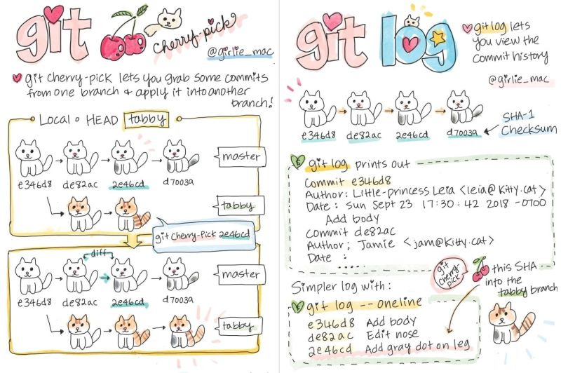
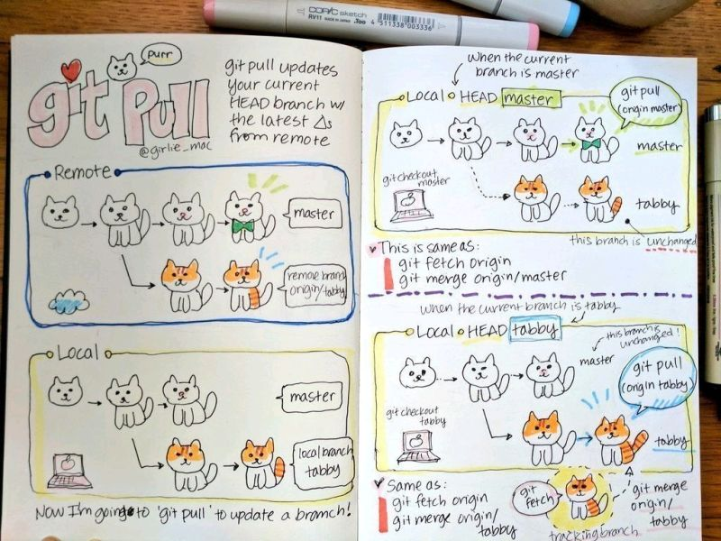
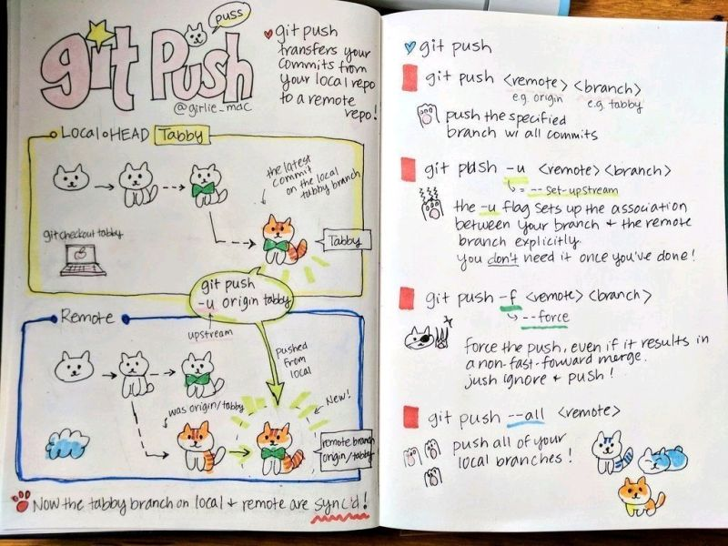
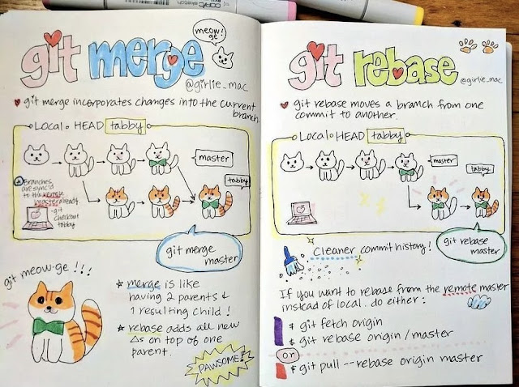

# Git Basics

## Setup

```bash
# Check git version
git --version

# Set username and email
git config --global user.name "Your Name"
git config --global user.email "youremail@mail.com"

# Set default branch as main
git config --global init.defaultBranch main

# Set automatic command line colouring for git
git config --global color.ui auto

# List all global git config variables
git config --list

# ssh setup
# Add id_ed25519.pub as ssh key on Github
# Path in Linux : ~/.ssh/id_ed25519.pub
# Path in Windows : /c/Users/you/.ssh/id_ed25519.pub
ssh-keygen -t ed25519 -C "youremail@mail.com"

# OR

# Store credentials
git config --global credential.helper store
```

## Start

```bash
# Create a local git repository
cd [path]
git init
```

## Stage and Snapshot

```bash
# Check the status of a repository. (View unstaged, staged and modified files)
git status

# Add a file from working area to staging area
git add [path]

# Create a snapshot of your staged changes
git commit -m "[descriptive message]"

# Change the commit message of last commit
git commit --amend -m "[new message]"

# Display the difference of what is changed but not staged 
git diff

# Display the difference of what is staged but not commited
git diff --staged

# Unstage a file while retaining the changes in working directory
git reset [file]
```

## Branch & Merge

```bash
# List your branches
git branch

# Create a new branch at the current commit
git branch [branch_name]

# Switch to another branch
git checkout [branch_name]

# Create and swtich to the branch
git checkout -b [branch_name]

# Merge the specified branch's history into the current one
git merge [branch_name]

# Show commit history of current branch
git log
```

## Remote repositories

```bash
# Clone a remote repository
git clone [url]

# Fetch the meta-data of remote repository
git fetch

# Transmit local changes to remote repository
git push

# Fetch and merge any commits from the remote branch
git pull
```

## Rewrite history

```bash
# Apply commits of current branch ahead of specified one
git rebase [branch_name]

# Reset to a specified commit and clear the staging area
git reset --hard [commit]

# Reset to a specified commit without clearing the staging area
git reset --soft [commit]
```

## Ignoring patterns

```bash
# Add files that you want to ignore in .gitignore file
*.txt
node_modules
```

## Temporary commits

```bash
# Save modified and staged changes
git stash

# List stashes
git stash list

# Apply changes from top stash stack
git stash apply

# Drop changes from top stash stack
git stash drop

# Apply and drop from top stash stack
git stash pop
```

---

## Common Commit Message Types
1. **`feat:` (Feature):**
   - Indicates the addition of a new feature or significant enhancement.

   Example:
   ```
   feat: Implement user authentication
   ```

2. **`fix:` (Bug Fix):**
   - Signifies a bug fix or correction of an existing issue.

   Example:
   ```
   fix: Resolve issue with login form validation
   ```

3. **`chore:` (Chores/Tasks):**
   - Used for routine tasks, maintenance, or other non-feature-related changes.

   Example:
   ```
   chore: Update build scripts
   ```

4. **`docs:` (Documentation):**
   - Indicates changes or additions to documentation.

   Example:
   ```
   docs: Update README with installation instructions
   ```

5. **`style:` (Code Style):**
   - Used when only the formatting or coding style is changed, without affecting the code's logic.

   Example:
   ```
   style: Format code according to style guide
   ```

6. **`refactor:` (Code Refactoring):**
   - Signifies changes to the codebase that neither fix a bug nor add a feature but improve the code structure or design.

   Example:
   ```
   refactor: Simplify error handling in user service
   ```

7. **`test:` (Tests):**
   - Indicates changes or additions to tests.

   Example:
   ```
   test: Add unit tests for authentication module
   ```

8. **`build:` (Build System):**
   - Used for changes that affect the build system or external dependencies.

   Example:
   ```
   build: Update npm packages to the latest version
   ```

9. **`ci:` (Continuous Integration):**
   - Signifies changes to the configuration or scripts related to continuous integration.

   Example:
   ```
   ci: Update Travis CI configuration
   ```

10. **`perf:` (Performance):**
    - Indicates changes that improve the performance of the code.

    Example:
    ```
    perf: Optimize database query for user retrieval
    ```

These prefixes help provide context and structure to your commit messages, making it easier for team members to understand the nature of changes in the project. The key is to adopt a convention that suits your team's workflow and stick to it consistently.

---

# Extras








